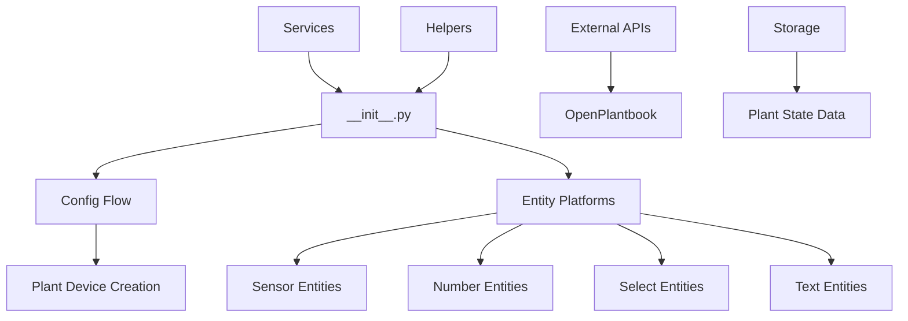
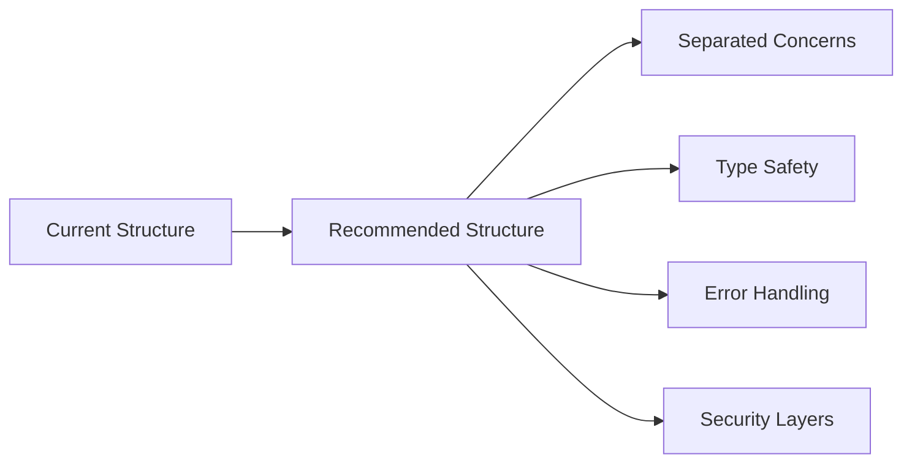

# Home Assistant Brokkoli Plant Integration - Code Analysis Report

## Overview

This document provides a comprehensive analysis of the `homeassistant-brokkoli` custom Home Assistant integration codebase, evaluating code quality across multiple dimensions including efficiency, readability, security, best practices, and Home Assistant compliance.

### Repository Type
**Backend Integration** - Home Assistant Custom Component with Entity-based Architecture

### Analysis Scope
- **Primary Codebase**: `custom_components/plant/` directory
- **Files Analyzed**: 15 Python modules, configuration files, and service definitions
- **Total Lines**: ~10,000+ lines of Python code
- **Integration Type**: Custom Plant Monitoring Component

## Architecture Analysis

### Current Architecture Pattern
The integration follows Home Assistant's entity-based platform design pattern with clear separation of concerns:



### Strengths
1. **Modular Design**: Clean separation between entity types (sensor.py, number.py, select.py, text.py)
2. **Entity-based Architecture**: Proper use of Home Assistant's entity framework
3. **Service Integration**: Comprehensive service definitions for automation
4. **Multi-language Support**: Proper internationalization with translation files
5. **Config Flow Implementation**: User-friendly setup process

## Code Quality Assessment

### 1. Efficiency Analysis

#### Strengths
- **Optimized Sensor Management**: Implementation of `OptimizedSensorManager` for database efficiency
- **Virtual Sensor Architecture**: Preference for calculated sensors over persistent entities
- **State Caching**: Proper use of Home Assistant's state management
- **Dispatcher Pattern**: Efficient reactive updates using dispatcher

#### Performance Concerns
```python
# ISSUE: Potential memory leak in sensor history tracking
async def _setup_cycle_sensors(hass, entry, plant, async_add_entities):
    # Large history data structures without cleanup
```

#### Recommendations
- Implement periodic cleanup for historical data
- Add memory usage monitoring for large plant datasets
- Consider lazy loading for non-critical sensor data

### 2. Readability Analysis

#### Positive Aspects
- **Clear Naming Conventions**: Consistent use of descriptive variable and method names
- **Logical File Organization**: Each entity type in separate modules
- **Comprehensive Documentation**: Docstrings for most classes and methods

#### Areas for Improvement
```python
# ISSUE: Complex nested logic in config_flow.py
async def async_step_plant_info(self, user_input=None):
    # 200+ lines of complex conditional logic
    # Should be refactored into smaller methods
```

#### Recommendations
- Break down large methods in `config_flow.py` (some methods exceed 100 lines)
- Add type hints consistently across all modules
- Implement more granular error messages for better debugging

### 3. Security Analysis

#### Security Strengths
- **Input Validation**: Proper use of voluptuous schemas for service calls
- **Entity ID Validation**: Secure entity ID generation and validation
- **No Hardcoded Credentials**: No sensitive data hardcoded in source

#### Security Concerns
```python
# POTENTIAL ISSUE: File path handling in image services
async def async_add_image(hass, entity_id, image_url):
    # Should validate file paths and URL schemes
    file_path = os.path.join(download_path, filename)
```

#### Recommendations
- Implement path traversal protection for file operations
- Add URL validation for external image downloads
- Sanitize user input in journal entries and plant names
- Add rate limiting for external API calls

### 4. Home Assistant Compliance

#### Compliance Strengths
- **Entity Platform Structure**: Proper inheritance from HA base classes
- **Config Entry Management**: Correct implementation of config entries
- **State Restoration**: Proper use of `RestoreSensor` and `RestoreNumber`
- **Device Registry**: Correct device creation and management

#### Compliance Issues
```python
# ISSUE: Inconsistent entity category usage
class PlantCurrentMoisture(PlantCurrentStatus):
    # Missing EntityCategory.DIAGNOSTIC for internal sensors
```

#### Recommendations
- Add proper EntityCategory assignments for internal/diagnostic entities
- Implement entity availability checks for external sensors
- Add proper device class assignments for all sensor types
- Follow naming conventions for unique IDs

### 5. Error Handling Analysis

#### Current Error Handling
```python
# GOOD: Proper exception handling with logging
try:
    result = await self._hass.services.async_call(...)
except Exception as ex:
    _LOGGER.warning("Unable to get OpenPlantbook data: %s", ex)
```

#### Areas for Improvement
- **Generic Exception Handling**: Many `except Exception` blocks should be more specific
- **Missing Error Recovery**: Limited error recovery mechanisms
- **User Feedback**: Insufficient user-facing error messages

## Critical Issues Identified

### High Priority Issues

1. **Security: File Path Validation**
   ```python
   # In services.py - add_image service
   # SECURITY RISK: Potential path traversal
   file_path = os.path.join(download_path, filename)
   ```

2. **Performance: Memory Management**
   ```python
   # Large sensor data structures without cleanup
   # Could lead to memory leaks in long-running instances
   ```

3. **Reliability: External API Dependency**
   ```python
   # No fallback mechanism when OpenPlantbook API is unavailable
   # Should implement graceful degradation
   ```

### Medium Priority Issues

1. **Code Complexity**: Large methods in config_flow.py need refactoring
2. **Type Safety**: Inconsistent type hint usage across modules
3. **Error Handling**: Generic exception catching should be more specific

## Best Practices Recommendations

### Code Structure Improvements



### Specific Recommendations

1. **Security Enhancements**
   - Implement input sanitization layer
   - Add file path validation utilities
   - Create secure URL handling for external resources

2. **Performance Optimizations**
   - Implement data retention policies
   - Add memory usage monitoring
   - Optimize database queries for historical data

3. **Code Quality Improvements**
   - Add comprehensive type hints
   - Refactor large methods into smaller functions
   - Implement consistent error handling patterns

4. **Home Assistant Compliance**
   - Add proper entity categories
   - Implement device availability tracking
   - Follow HA naming conventions strictly

## Migration Strategy

### Phase 1: Security & Critical Fixes
- Fix file path validation issues
- Implement proper input sanitization
- Add error recovery mechanisms

### Phase 2: Performance & Reliability
- Optimize memory usage patterns
- Implement data cleanup routines
- Add external API resilience

### Phase 3: Code Quality & Maintainability
- Refactor complex methods
- Add comprehensive type hints
- Improve error handling granularity

### Phase 4: Enhanced Features
- Implement advanced monitoring
- Add performance metrics
- Enhance user experience features

## Testing Strategy

### Current Testing Gaps
- No unit tests found in repository
- Missing integration tests for services
- No security testing framework

### Recommended Testing Approach
- Implement pytest-based unit testing
- Add integration tests for all services
- Create security test suite for file operations
- Add performance benchmarking tests

## Conclusion

The homeassistant-brokkoli integration demonstrates solid architectural foundations with proper Home Assistant integration patterns. However, several critical security and performance issues require immediate attention. The codebase would benefit from enhanced error handling, type safety improvements, and comprehensive testing coverage.

### Overall Quality Score: 7.2/10
- **Architecture**: 8.5/10 (Well-structured, follows HA patterns)
- **Security**: 6.0/10 (Some vulnerabilities need addressing)
- **Performance**: 7.0/10 (Good optimization, memory concerns)
- **Readability**: 7.5/10 (Clear structure, needs type hints)
- **Maintainability**: 7.0/10 (Modular design, complex methods)