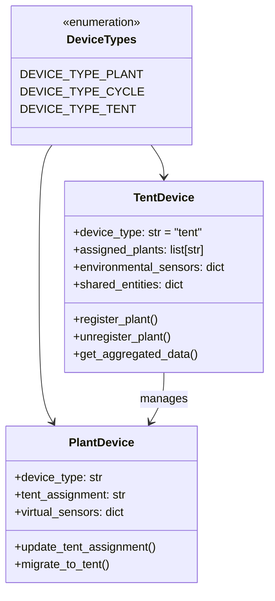
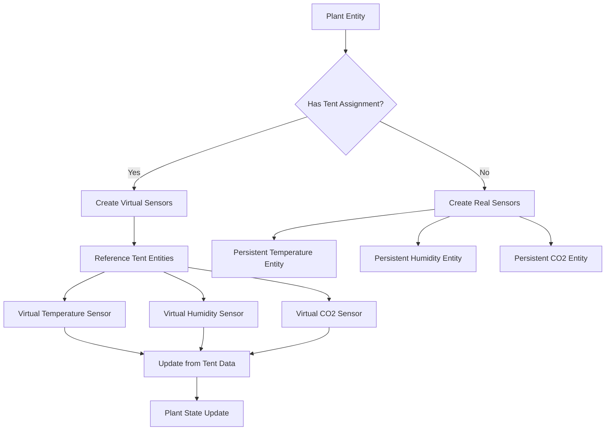
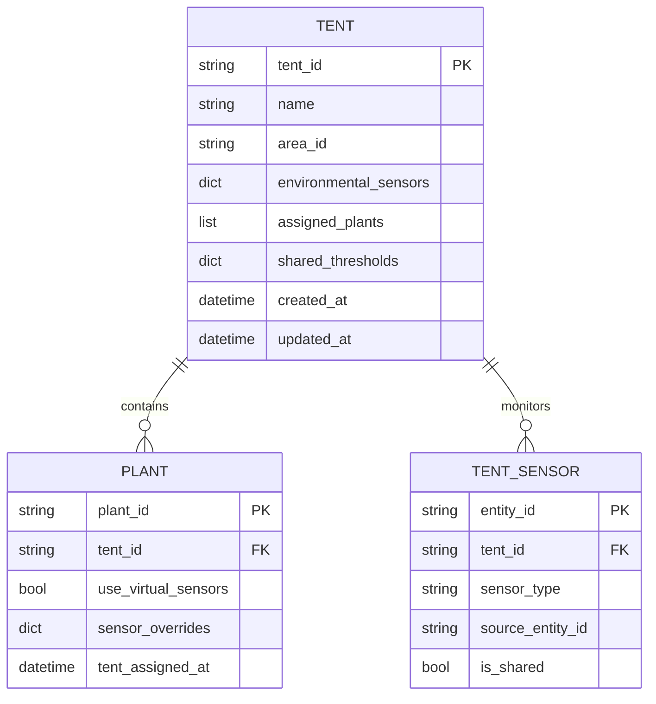
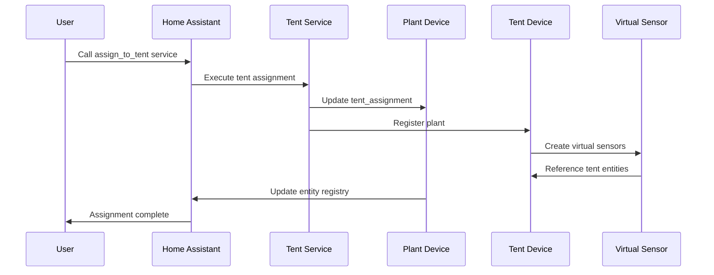
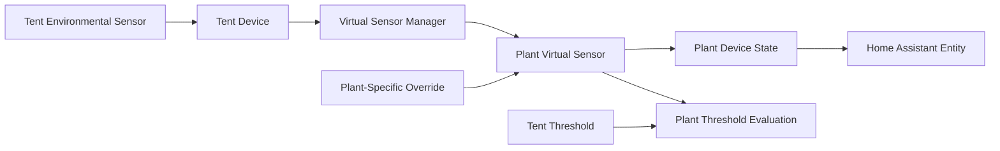
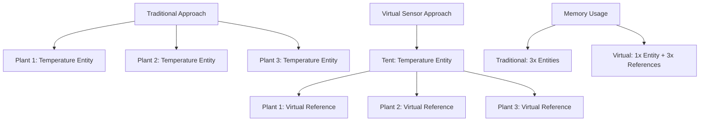

# Tent Management Feature Design

## Overview

This design document outlines the implementation of a tent management feature for the homeassistant-brokkoli Home Assistant integration. The feature will extend the existing plant and cycle management system to include tent entities, enabling users to manage environmental zones and efficiently move plants between different growing environments while maintaining sensor data continuity.

## Technology Stack & Dependencies

- **Framework**: Home Assistant Custom Integration (Python 3)
- **Base Integration**: homeassistant-brokkoli plant component
- **Dependencies**: 
  - Existing plant component architecture
  - Virtual sensor architecture from performance_utils
  - Security utilities for entity validation
  - Home Assistant Entity Registry and Device Registry

## Architecture

### Device Type Extension

The tent management feature extends the existing device type pattern (`DEVICE_TYPE_PLANT`, `DEVICE_TYPE_CYCLE`) with a new tent device type:



### Virtual Sensor Architecture

To implement memory-efficient tent management, the system will utilize virtual sensors that reference existing tent entities instead of creating duplicate persistent entities:



### Tent Entity Structure



## Core Components

### 1. Tent Device Class

**Location**: `custom_components/plant/__init__.py` (extend existing PlantDevice)

```python
class TentDevice(PlantDevice):
    """Tent device for managing environmental zones."""
    
    def __init__(self, hass: HomeAssistant, entry: ConfigEntry):
        super().__init__(hass, entry)
        self.device_type = DEVICE_TYPE_TENT
        self._assigned_plants: list[str] = []
        self._environmental_sensors: dict = {}
        self._shared_thresholds: dict = {}
```

### 2. Virtual Sensor Implementation

**Location**: `custom_components/plant/sensor.py` (extend existing sensor platform)

Virtual sensors will be implemented using the existing performance optimization patterns:

- Reference external tent sensors instead of creating new entities
- Update only when tent assignment changes
- Minimal memory footprint through reference-based architecture

### 3. Tent Assignment Service

**Location**: `custom_components/plant/services.py`

New service similar to `plant.replace_sensor` for tent operations:

```yaml
# services.yaml addition
assign_to_tent:
  name: Assign Plant to Tent
  description: Assign a plant to a tent environment
  fields:
    plant_entity:
      name: Plant Entity
      description: Plant entity to assign
      required: true
      selector:
        entity:
          domain: plant
    tent_entity:
      name: Tent Entity
      description: Target tent entity
      required: true
      selector:
        entity:
          domain: plant
          device_class: tent
    migrate_sensors:
      name: Migrate Sensors
      description: Replace individual sensors with tent references
      default: true
      selector:
        boolean:
```

## Data Flow Between Layers

### Tent Assignment Process



### Sensor Data Flow with Virtual Sensors



## Memory Optimization Strategy

### Virtual Sensor Architecture

1. **Reference-Based Sensors**: Virtual sensors reference tent entity IDs instead of storing duplicate data
2. **Update Triggers**: Virtual sensors update only when:
   - Tent assignment changes
   - Referenced tent sensor updates
   - Plant-specific overrides are modified

3. **Memory Management**: Utilize existing `MemoryManager` class with tent-specific cleanup:
   - Clean up orphaned tent assignments
   - Remove unused virtual sensor references
   - Optimize tent aggregation data

### Storage Efficiency



## Implementation Plan

### Phase 1: Core Tent Entity

1. **Extend Constants** (`const.py`):
   ```python
   DEVICE_TYPE_TENT = "tent"
   ICON_DEVICE_TENT = "mdi:home-outline"
   FLOW_TENT_ENTITY = "tent_entity"
   SERVICE_ASSIGN_TO_TENT = "assign_to_tent"
   SERVICE_UNASSIGN_FROM_TENT = "unassign_from_tent"
   ```

2. **Tent Device Implementation** (`__init__.py`):
   - Extend PlantDevice with tent-specific logic
   - Implement plant registration/unregistration
   - Add tent aggregation methods

3. **Configuration Flow Updates** (`config_flow.py`):
   - Add tent creation workflow
   - Tent sensor assignment interface
   - Plant-to-tent assignment options

### Phase 2: Virtual Sensor System

1. **Virtual Sensor Manager** (`sensor.py`):
   - Implement VirtualSensorEntity class
   - Reference-based state management
   - Integration with OptimizedSensorManager

2. **Tent Assignment Logic** (`services.py`):
   - Implement assign_to_tent service
   - Migration logic for existing sensors
   - Rollback functionality for failures

3. **Entity Registry Management**:
   - Update entity categories for tent sensors
   - Proper device assignments
   - Area management integration

### Phase 3: Advanced Features

1. **Threshold Inheritance**:
   - Plants inherit tent thresholds by default
   - Override mechanism for plant-specific limits
   - Cascade updates when tent thresholds change

2. **Aggregation and Analytics**:
   - Tent-level health scoring
   - Plant performance comparison within tents
   - Environmental optimization suggestions

## Entity Reference

### New Entity Types

#### Tent Sensor Entities
- `sensor.tent_[name]_temperature`
- `sensor.tent_[name]_humidity`
- `sensor.tent_[name]_co2`
- `sensor.tent_[name]_light_hours`
- `sensor.tent_[name]_plant_count`

#### Virtual Plant Sensors (when assigned to tent)
- `sensor.plant_[name]_temperature` → References tent temperature
- `sensor.plant_[name]_humidity` → References tent humidity
- `sensor.plant_[name]_co2` → References tent CO2

#### Tent Configuration Entities
- `number.tent_[name]_min_temperature`
- `number.tent_[name]_max_temperature`
- `select.tent_[name]_light_schedule`
- `text.tent_[name]_notes`

## Testing Strategy

### Unit Testing
1. **Tent Device Tests**:
   - Plant assignment/unassignment
   - Sensor aggregation logic
   - Threshold inheritance

2. **Virtual Sensor Tests**:
   - Reference resolution
   - State update propagation
   - Memory usage validation

3. **Service Tests**:
   - Tent assignment workflows
   - Error handling and rollback
   - Entity registry updates

### Integration Testing
1. **End-to-End Workflows**:
   - Create tent → assign plants → verify sensors
   - Move plants between tents
   - Remove tent with assigned plants

2. **Performance Testing**:
   - Memory usage with virtual sensors
   - Database query optimization
   - Large-scale tent management (10+ tents, 50+ plants)

## Configuration Schema

### Tent Entity Configuration
```yaml
tent_info:
  name: "Flower Tent 1"
  area_id: "grow_room"
  environmental_sensors:
    temperature_sensor: "sensor.tent1_temperature"
    humidity_sensor: "sensor.tent1_humidity"
    co2_sensor: "sensor.tent1_co2"
    light_sensor: "sensor.tent1_ppfd"
  shared_thresholds:
    min_temperature: 20
    max_temperature: 28
    min_humidity: 45
    max_humidity: 65
    min_co2: 400
    max_co2: 1200
  light_schedule:
    flowering: "12/12"
    vegetative: "18/6"
```

### Plant Tent Assignment
```yaml
plant_info:
  tent_assignment:
    tent_entity_id: "plant.tent_flower_1"
    use_virtual_sensors: true
    sensor_overrides:
      temperature_sensor: "sensor.plant_specific_temp"  # Override tent sensor
    assigned_at: "2024-01-15T10:30:00Z"
```