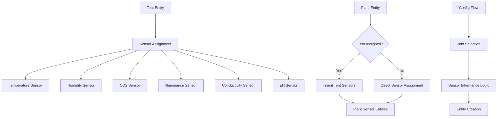
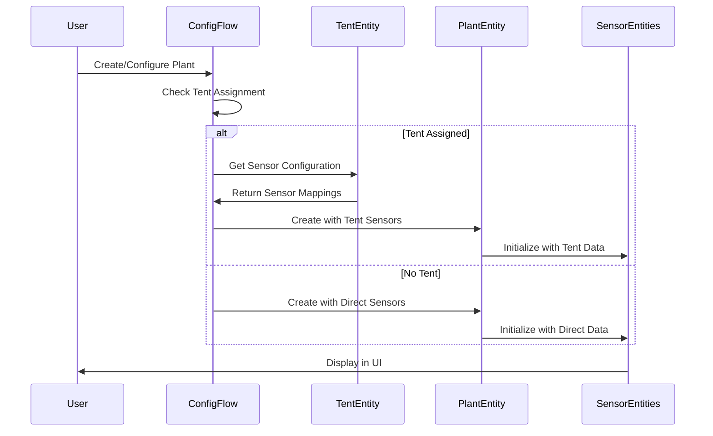
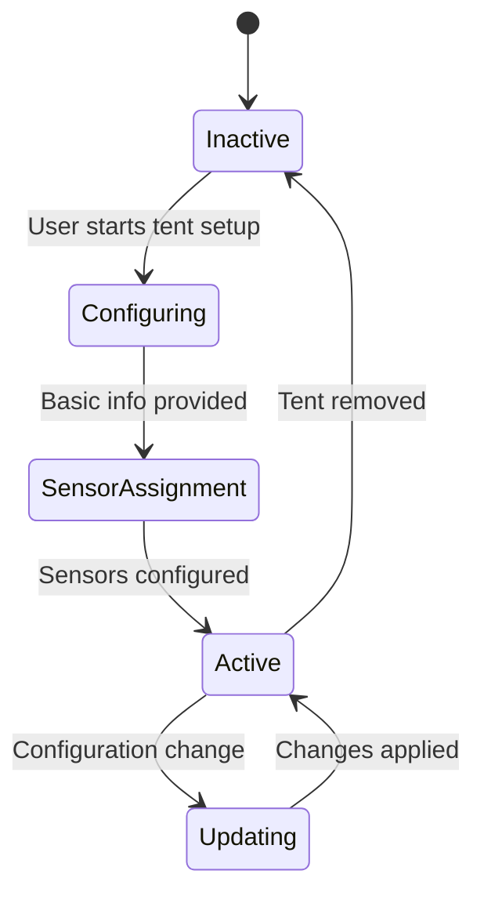
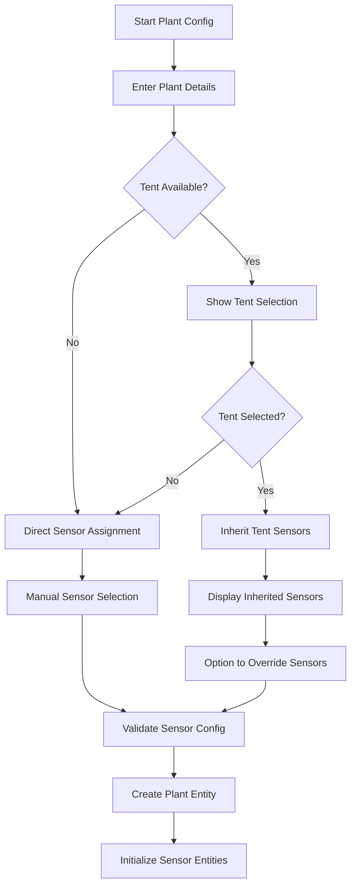
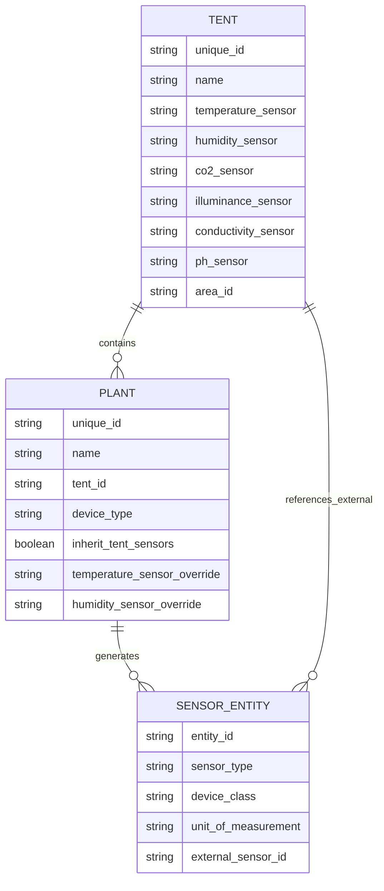
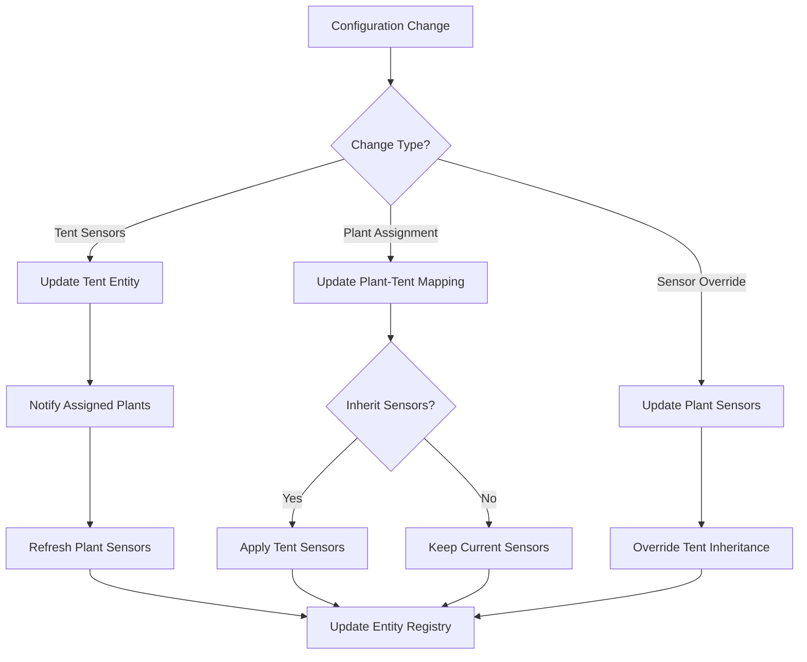
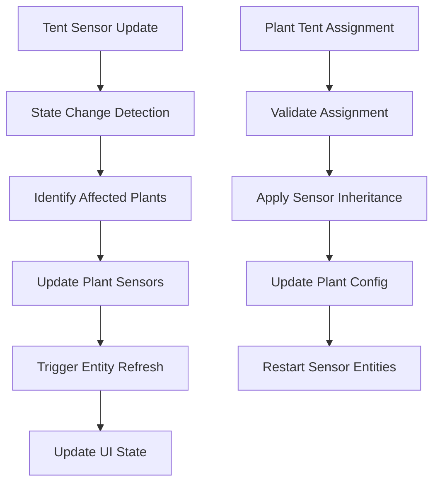

# Tent-Sensor Integration Design

## Overview

This design outlines the integration of tent entities with sensor management in the Home Assistant Brokkoli cannabis cultivation system. The primary goal is to enable plants to automatically inherit environmental sensors (temperature, humidity, CO2, etc.) from the tent they are assigned to, providing centralized sensor management and reducing configuration overhead.

## Current Architecture Analysis

### Repository Type Detection
The homeassistant-brokkoli project is a **Backend Custom Integration** for Home Assistant, built as a Python-based custom component following the Home Assistant integration architecture pattern.

### Existing Components
- **TentDevice**: Basic tent entity structure in `tent.py`
- **TentConfigFlow**: Simple tent creation flow in `config_flow_tent.py`
- **PlantConfigFlow**: Comprehensive plant configuration in `config_flow.py`
- **Sensor Management**: Current sensors are directly assigned to plants via `sensor.py`

## Architecture Design

### Component Interaction Model



### Data Flow Architecture



## Enhanced TentDevice Implementation

### Sensor Management Extensions

| Sensor Type | Property | External Entity Reference |
|-------------|----------|---------------------------|
| Temperature | `temperature_sensor` | `entity_id` of external temp sensor |
| Humidity | `humidity_sensor` | `entity_id` of external humidity sensor |
| CO2 | `co2_sensor` | `entity_id` of external CO2 sensor |
| Illuminance | `illuminance_sensor` | `entity_id` of external illuminance sensor |
| Conductivity | `conductivity_sensor` | `entity_id` of external conductivity sensor |
| pH | `ph_sensor` | `entity_id` of external pH sensor |

### State Management Logic



## Config Flow Enhancement Design

### Tent Configuration Flow

The tent configuration flow will be enhanced to include comprehensive sensor assignment:

#### Step 1: Basic Tent Information
- Tent name input
- Optional description field
- Physical location/area assignment

#### Step 2: Environmental Sensor Assignment
- Temperature sensor selection from available entities
- Humidity sensor selection
- CO2 sensor selection (optional)
- Illuminance/Light sensor selection
- pH sensor selection (optional)
- Conductivity sensor selection (optional)

#### Step 3: Validation and Creation
- Validate sensor entity availability
- Check sensor compatibility
- Create tent entity with sensor mappings

### Plant Configuration Flow Integration

#### Enhanced Plant Creation Logic



### Sensor Inheritance Hierarchy

| Priority | Source | Description |
|----------|--------|-------------|
| 1 | Plant Override | Manually assigned sensors to specific plant |
| 2 | Tent Assignment | Sensors inherited from assigned tent |
| 3 | Default | No external sensors, internal sensor entities only |

## Entity Relationship Model

### Tent-Plant Relationship



## Data Models & ORM Mapping

### Configuration Data Structure

```python
TentConfigData = {
    "name": str,
    "area_id": Optional[str],
    "sensors": {
        "temperature": Optional[str],
        "humidity": Optional[str],
        "co2": Optional[str],
        "illuminance": Optional[str],
        "conductivity": Optional[str],
        "ph": Optional[str]
    },
    "description": Optional[str]
}

PlantConfigData = {
    "name": str,
    "tent_id": Optional[str],
    "inherit_tent_sensors": bool,
    "sensor_overrides": {
        "temperature": Optional[str],
        "humidity": Optional[str],
        # ... other sensor types
    },
    # ... existing plant configuration
}
```

### Entity State Attributes

```python
TentStateAttributes = {
    "sensor_count": int,
    "assigned_plants": List[str],
    "sensor_mappings": Dict[str, str],
    "last_updated": datetime,
    "configuration_status": str
}

PlantStateAttributes = {
    # ... existing attributes
    "tent_assignment": Optional[str],
    "sensor_inheritance": bool,
    "sensor_sources": Dict[str, str]  # sensor_type -> source (tent/direct/none)
}
```

## Business Logic Layer

### Sensor Assignment Logic

#### Tent Sensor Discovery
```python
class TentSensorManager:
    async def discover_available_sensors(self, hass: HomeAssistant) -> Dict[str, List[str]]:
        """Discover sensors by device class for tent assignment."""
        
    async def validate_sensor_assignment(self, sensor_id: str, sensor_type: str) -> bool:
        """Validate that a sensor can be assigned to a tent."""
        
    async def get_tent_sensor_config(self, tent_id: str) -> Dict[str, str]:
        """Retrieve sensor configuration for a specific tent."""
```

#### Plant Sensor Inheritance
```python
class PlantSensorInheritance:
    async def resolve_sensor_assignment(self, plant_config: dict) -> Dict[str, str]:
        """Resolve final sensor assignments considering inheritance and overrides."""
        
    async def apply_tent_sensors(self, plant: PlantDevice, tent: TentDevice) -> None:
        """Apply tent sensor configuration to plant entity."""
        
    async def handle_tent_reassignment(self, plant_id: str, new_tent_id: str) -> None:
        """Handle plant reassignment to different tent."""
```

### Configuration Update Logic



## API Integration Layer

### Service Definitions

#### Tent Management Services
```yaml
assign_tent_sensors:
  description: "Assign sensors to a tent entity"
  fields:
    tent_id:
      description: "Tent entity ID"
      required: true
    sensors:
      description: "Sensor mappings"
      required: true

move_plant_to_tent:
  description: "Move plant to a different tent"
  fields:
    plant_id:
      description: "Plant entity ID" 
      required: true
    tent_id:
      description: "Target tent entity ID"
      required: true
    inherit_sensors:
      description: "Whether to inherit tent sensors"
      default: true
```

#### Plant Sensor Override Services
```yaml
override_plant_sensor:
  description: "Override specific sensor for a plant"
  fields:
    plant_id:
      description: "Plant entity ID"
      required: true
    sensor_type:
      description: "Type of sensor to override"
      required: true
    sensor_entity:
      description: "New sensor entity ID"
      required: true
```

### Entity Registry Integration

```python
class TentEntityRegistration:
    async def register_tent_device(self, hass: HomeAssistant, config: dict) -> str:
        """Register tent as Home Assistant device."""
        
    async def update_tent_sensors(self, tent_id: str, sensor_mapping: dict) -> None:
        """Update tent sensor configuration in entity registry."""

class PlantTentIntegration:
    async def link_plant_to_tent(self, plant_id: str, tent_id: str) -> None:
        """Create link between plant and tent entities."""
        
    async def sync_sensor_entities(self, plant_id: str) -> None:
        """Synchronize plant sensor entities with tent configuration."""
```

## Middleware & Configuration Management

### Validation Middleware

```python
class TentConfigValidator:
    async def validate_tent_config(self, config_data: dict) -> Tuple[bool, List[str]]:
        """Validate tent configuration data."""
        
    async def validate_sensor_compatibility(self, sensor_id: str, expected_type: str) -> bool:
        """Validate sensor entity compatibility."""

class PlantTentValidator:
    async def validate_tent_assignment(self, plant_id: str, tent_id: str) -> bool:
        """Validate that plant can be assigned to tent."""
```

### State Synchronization



## Testing Strategy

### Unit Testing

| Component | Test Coverage |
|-----------|---------------|
| TentDevice | Sensor assignment, state management |
| TentConfigFlow | Flow validation, sensor discovery |
| PlantSensorInheritance | Inheritance logic, override handling |
| SensorValidation | Entity compatibility, configuration validation |

### Integration Testing

```python
class TentIntegrationTests:
    async def test_tent_creation_with_sensors(self):
        """Test complete tent creation flow with sensor assignment."""
        
    async def test_plant_tent_assignment(self):
        """Test plant assignment to tent and sensor inheritance."""
        
    async def test_sensor_override_functionality(self):
        """Test plant-specific sensor overrides."""
        
    async def test_tent_sensor_update_propagation(self):
        """Test that tent sensor updates propagate to plants."""
```

### Configuration Flow Testing

- Tent creation with various sensor combinations
- Plant creation with tent assignment
- Sensor inheritance validation
- Override functionality verification
- Error handling for invalid configurations

## Implementation Phases

### Phase 1: Core Tent Enhancement
- Enhance TentDevice with comprehensive sensor management
- Update tent configuration flow for sensor assignment
- Implement basic tent-plant relationship

### Phase 2: Plant Integration
- Modify plant configuration flow to support tent selection
- Implement sensor inheritance logic
- Add tent assignment validation

### Phase 3: Dynamic Updates
- Implement real-time sensor updates
- Add plant reassignment functionality
- Create sensor override capabilities

### Phase 4: Services & Automation
- Develop tent management services
- Create automation-friendly APIs
- Implement advanced validation and error handling