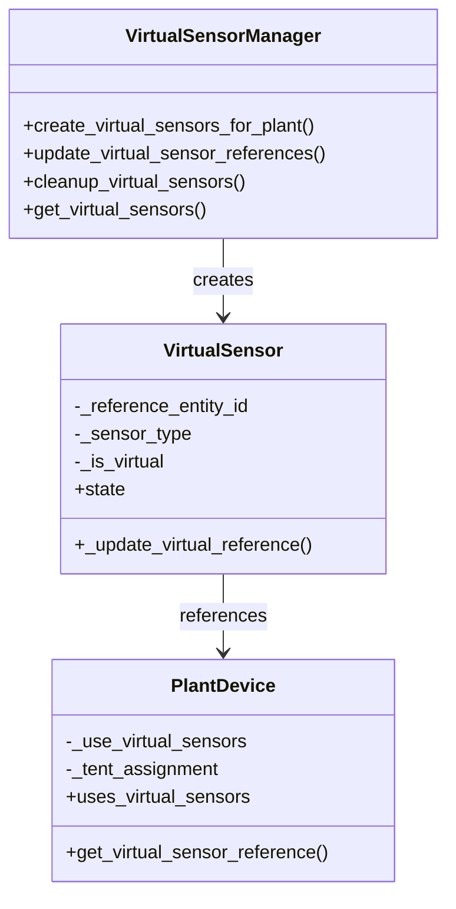

# Virtual Entities Review for Home Assistant Plant Integration

## 1. Overview

This document analyzes the implementation and necessity of virtual entities in the Home Assistant Plant integration. Virtual entities are sensors that reference other entities instead of maintaining their own state storage, primarily used for plants assigned to tents.

## 2. Current Implementation

### 2.1 Virtual Sensor Architecture

The plant integration implements virtual sensors through a dedicated `VirtualSensor` class and `VirtualSensorManager`. These sensors are used in two scenarios:

1. **Tent-assigned plants**: Plants that inherit sensor data from a tent device
2. **Standalone plants with virtual sensors enabled**: Plants that use virtual sensors but maintain their own sensor references

### 22 Virtual Sensor Implementation Details

### 2.3 Virtual Sensor Behavior

1. **Reference Management**: Virtual sensors update their references based on plant configuration
2. **State Inheritance**: They inherit state from referenced entities rather than maintaining independent state
3. **Fallback Mechanism**: For standalone virtual sensors, they can fall back to direct external sensor mappings

## 3. Use Cases Analysis

### 3.1 Tent-Assigned Plants

When a plant is assigned to a tent:
- Virtual sensors are created for the plant
- These sensors reference the tent's environmental sensors
- Changes to tent sensors automatically propagate to plant sensors

### 3.2 Standalone Plants with Virtual Sensors

Plants can use virtual sensors without tent assignment:
- Enabled by setting `uses_virtual_sensors = True`
- Can reference external sensors directly
- Provides consistent behavior with tent-assigned plants

### 3.3 Regular Plants (Non-Virtual)

Traditional plant implementation:
- Uses regular sensor entities with independent state storage
- Directly references external sensors
- No virtual sensor overhead

## 4. Issues with Current Implementation

### 4.1 Standalone Plant Virtual Sensor Issues

Based on code analysis, there appears to be a potential issue with standalone plants using virtual sensors:

1. **Reference Resolution**: The `_update_virtual_reference` method in `VirtualSensor` attempts to get references from the plant device, but for standalone plants without tent assignment, this may return `None`

2. **State Handling**: When no reference is found, virtual sensors return `STATE_UNAVAILABLE` which may cause problems in the plant's problem detection logic

3. **Configuration Flow**: Plants are automatically configured to use virtual sensors when assigned to a tent, but there's no clear UI path for enabling virtual sensors for standalone plants

### 4.2 Code Complexity

The virtual sensor implementation adds significant complexity:
- Additional manager class to maintain
- Complex reference resolution logic
- Dual path sensor creation (virtual vs regular)
- Fallback mechanisms that may not be well-tested

## 5. Benefits of Virtual Sensors

### 5.1 Memory Optimization

Virtual sensors reduce memory usage by:
- Sharing state references instead of duplicating data
- Reducing the number of independent state storage objects

### 5.2 Consistent Behavior

Virtual sensors provide a unified interface for:
- Tent-assigned plants
- Standalone plants (if properly implemented)
- Simplified sensor management

### 5.3 Performance Improvements

Potential performance benefits include:
- Reduced entity update overhead
- Centralized reference management
- Efficient state propagation

## 6. Recommendations

### 6.1 Keep Virtual Entities (Recommended)

Virtual entities should be retained but with improvements:

#### Pros of Keeping:
1. **Memory Efficiency**: Significant memory savings for installations with many plants
2. **Tent Integration**: Essential for proper tent-assigned plant functionality
3. **Consistent Architecture**: Provides a unified approach to sensor management

#### Required Improvements:
1. **Fix Standalone Plant Support**: Ensure virtual sensors work correctly for standalone plants
2. **Improve Error Handling**: Better handling of missing references
3. **Enhance Documentation**: Clear guidance on when to use virtual vs regular sensors
4. **Add Configuration Options**: UI controls for enabling virtual sensors on standalone plants

### 6.2 Alternative: Simplified Approach

If issues cannot be resolved, consider a simplified approach:

#### Option 1: Tent-Only Virtual Sensors
- Only use virtual sensors for tent-assigned plants
- Keep regular sensors for standalone plants
- Remove complexity for standalone virtual sensors

#### Option 2: Remove Virtual Sensors Entirely
- Revert to regular sensor implementation for all plants
- Accept memory overhead for simplicity
- Simplify maintenance and debugging

## 7. Implementation Plan

### 7.1 Immediate Fixes

1. **Standalone Plant Virtual Sensor Fix**:
   - Ensure `_update_virtual_reference` properly handles standalone plants
   - Fix state handling when references are missing
   - Add proper fallback to external sensor mappings

2. **Testing Improvements**:
   - Add comprehensive tests for standalone virtual sensors
   - Test reference resolution edge cases
   - Validate problem detection with virtual sensors

### 7.2 Medium-term Improvements

1. **Configuration UI**:
   - Add option to enable virtual sensors for standalone plants
   - Show clear indication of sensor type in UI
   - Provide guidance on when to use virtual sensors

2. **Documentation**:
   - Update user documentation on virtual sensors
   - Add developer documentation on implementation details
   - Create troubleshooting guide for virtual sensor issues

### 7.3 Long-term Considerations

1. **Performance Monitoring**:
   - Add metrics for virtual sensor performance
   - Monitor memory usage improvements
   - Track entity update efficiency

2. **Architecture Refinement**:
   - Consider abstracting sensor management further
   - Evaluate if virtual sensors could be made the default
   - Explore additional use cases for virtual sensor pattern

## 8. Risk Assessment

### 8.1 Risks of Keeping Virtual Sensors

1. **Complexity Maintenance**: Ongoing complexity in codebase
2. **Debugging Difficulty**: Harder to troubleshoot sensor issues
3. **Edge Case Bugs**: Potential issues with reference resolution

### 8.2 Risks of Removing Virtual Sensors

1. **Memory Overhead**: Increased memory usage for large installations
2. **Feature Regression**: Loss of tent integration benefits
3. **Performance Impact**: More entity updates and state management

## 9. Conclusion

Virtual entities in the plant integration serve an important purpose, particularly for tent-assigned plants. While there appear to be issues with standalone plant support, these can be addressed through targeted fixes rather than complete removal.

The memory and performance benefits of virtual sensors justify their continued use, especially as the integration scales to support more complex grow operations with multiple tents and plants.