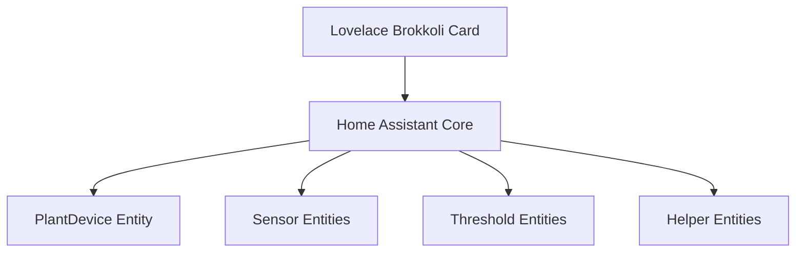

# Home Assistant Brokkoli Integration Architecture

## Overview

The Home Assistant Brokkoli integration provides comprehensive plant monitoring capabilities within Home Assistant. It follows Home Assistant's component architecture using config entries for persistent configuration and entity-based modeling for device representation.

## Core Components

### 1. PlantDevice Class

The main entity that represents a plant or cycle in Home Assistant. It manages:
- Sensor entities (temperature, moisture, etc.)
- Threshold entities (min/max values)
- Calculated entities (virtual sensors like DLI, PPFD, consumption)
- Helper entities (configuration entities)

### 2. Sensor Entities

Individual sensor readings that can be either:
- **Environmental Sensors**: Direct readings from physical sensors (temperature, moisture, etc.)
- **Calculated Sensors**: Virtual sensors derived from other sensors (DLI, PPFD, consumption)
- **Consumption Sensors**: Track resource usage over time (water, fertilizer, power)

### 3. Threshold Entities

Min/max values that define healthy ranges for each sensor type. These are used to detect problem states when sensor values exceed limits.

### 4. Helper Entities

Configuration entities that allow users to set parameters:
- Number entities (growth duration, pot size, etc.)
- Select entities (growth phase, treatment, etc.)
- Text entities (journal, location history, etc.)

## Integration Architecture

### Entity-Based Communication



The Lovelace card fetches data from Home Assistant entities using the standard Home Assistant API. Each plant is represented as a device with multiple associated entities.

### WebSocket API

The Lovelace card uses a custom WebSocket API to retrieve detailed plant information:

```typescript
const response = await hass.callWS({
    type: "plant/get_info",
    entity_id: plantEntityId,
});
```

This API provides consolidated plant data including current sensor readings, thresholds, and helper entity information.

### Sensor Mapping

The integration uses a `_sensorMap` attribute to track which external sensors are associated with each plant parameter:

```javascript
// In Lovelace card
const getSensorMapEntityId = (plant, attribute) => {
    if (plant.attributes._sensorMap && plant.attributes._sensorMap[attribute]) {
        return plant.attributes._sensorMap[attribute];
    }
    return null;
};
```

## Sensor Categories

### Environmental Sensors

Direct readings from physical sensors:
- Temperature
- Moisture
- Conductivity
- Illuminance
- Humidity
- CO2
- pH

### Calculated Sensors

Virtual sensors derived from other sensors:
- PPFD (Photosynthetic Photon Flux Density)
- DLI (Daily Light Integral)
- Total Light Integral
- Moisture Consumption
- Fertilizer Consumption

### Consumption Sensors

Track resource usage over time:
- Total Water Consumption
- Total Fertilizer Consumption
- Power Consumption
- Energy Cost

## Sensor Definition Structure

```python
@dataclass
class SensorDefinition:
    """Complete definition for a plant sensor."""
    
    # Basic properties
    sensor_type: str              # Internal identifier
    display_name: str             # User-friendly name
    icon: str                     # Material Design icon
    
    # Home Assistant compliance
    device_class: Optional[SensorDeviceClass] = None
    state_class: Optional[SensorStateClass] = None
    entity_category: Optional[EntityCategory] = None
    unit_of_measurement: Optional[str] = None
    
    # Precision settings
    display_precision: int = 2    # Decimal places for display
    calculation_precision: int = 3 # Decimal places for calculations
    
    # Additional properties
    min_value: Optional[float] = None
    max_value: Optional[float] = None
    step: Optional[float] = None
    virtual: bool = False         # True for calculated/virtual sensors
    
    # Description for UI
    description: Optional[str] = None
```

## WebSocket API Response Structure

The custom WebSocket API provides consolidated plant information:

```json
{
    "device_type": "plant",
    "entity_id": "plant.my_plant",
    "name": "My Plant",
    "icon": "mdi:flower-outline",
    "state": "ok",
    "temperature": {
        "max": "30",
        "min": "10", 
        "current": "22.5",
        "icon": "mdi:thermometer",
        "unit_of_measurement": "°C",
        "sensor": "sensor.temperature_1"
    },
    "diagnostic_sensors": {
        "total_water_consumption": {
            "entity_id": "sensor.my_plant_total_water_consumption",
            "current": "5.2",
            "icon": "mdi:water-pump",
            "unit_of_measurement": "L"
        }
    },
    "helpers": {
        "growth_phase": {
            "entity_id": "select.my_plant_growth_phase",
            "current": "vegetative",
            "icon": "mdi:leaf",
            "options": ["seeds", "germination", "vegetative", "flowering"],
            "type": "select"
        }
    }
}
```

## Sensor Mapping

The `_sensorMap` attribute tracks external sensor assignments:

```yaml
_sensorMap:
  temperature: sensor.temperature_1
  moisture: sensor.soil_moisture_1
  illuminance: sensor.light_sensor_1
```