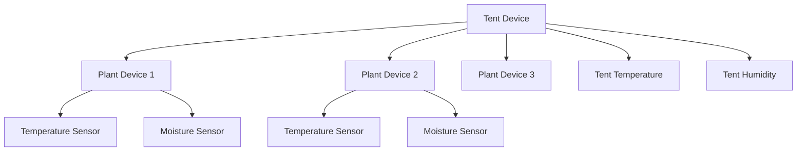

# Tent Integration Design Document

## Overview

This document describes the proposed tent integration for the Home Assistant Brokkoli integration. Tents are environmental control systems that house plants and provide controlled growing conditions.

## Tent Entity Structure

### TentDevice Class

The TentDevice class should represent an environmental control system that can house multiple plants. It should have:

1. **Tent Sensors**: Environmental readings from the tent (temperature, humidity, etc.)
2. **Control Entities**: Entities for controlling tent equipment (lights, fans, etc.)
3. **Plant Assignment**: Mechanism for assigning plants to tents

### Relationship with Plants

## Integration Approach

Rather than creating a separate tent device type, the tent integration should:

1. **Extend Plant Functionality**: Add tent-related attributes and sensors to existing PlantDevice class
2. **Sensor Sharing**: Allow plants to share tent sensor data
3. **Environmental Monitoring**: Provide environmental data at the tent level
4. **Control Integration**: Integrate with climate control entities

## Tent Sensors

### Environmental Sensors
- Tent Temperature
- Tent Humidity
- Tent CO2
- Tent Illuminance
- Tent Conductivity
- Tent pH

### Control Entities
- Climate control entities
- Lighting control entities
- Ventilation control entities
- Irrigation control entities

## Implementation Plan

### Phase 1: Basic Tent Integration
1. Add tent sensor attributes to PlantDevice
2. Implement tent sensor mapping
3. Extend config flow to support tent sensor assignment

### Phase 2: Advanced Features
1. Add tent-level environmental monitoring
2. Implement control entity integration
3. Add tent-specific helper entities

### Phase 3: Visualization
1. Update Lovelace card to display tent data
2. Add tent-specific UI components
3. Implement tent-plant relationship visualization