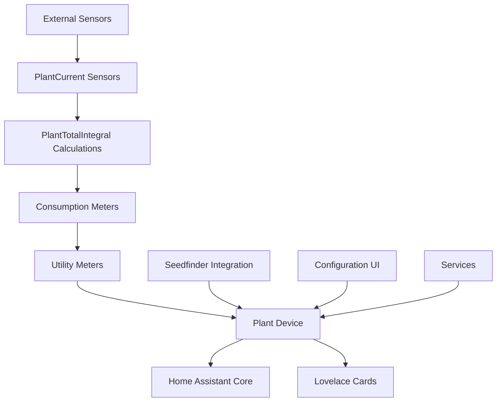

# Brokkoli Cannabis Management - Developer Documentation

## Table of Contents
1. [Overview](#overview)
2. [Architecture](#architecture)
3. [Component Structure](#component-structure)
4. [Entity Types](#entity-types)
5. [Data Flow](#data-flow)
6. [Core Components](#core-components)
7. [Services API](#services-api)
8. [Configuration](#configuration)
9. [Testing Strategy](#testing-strategy)
10. [Best Practices](#best-practices)
11. [Troubleshooting](#troubleshooting)

## Overview

The Brokkoli Plant Manager is a Home Assistant custom integration designed for cannabis cultivation monitoring. It provides comprehensive plant monitoring capabilities with device-based management, sensor integration, threshold configuration, and data visualization through the Brokkoli Lovelace cards.

### Key Features

- Device-based plant management with grouped sensor entities
- Configurable thresholds for each sensor type with problem state detection
- Integration with Seedfinder for strain data and information
- Consumption tracking for water, fertilizer, and power usage
- Cycle system for grouping multiple plants together
- Comprehensive service API for plant management operations
- Support for spatial plant arrangement with drag & drop positioning

## Architecture

### Component Structure

The integration consists of several key components:

```
custom_components/plant/
├── __init__.py              # Main integration setup and entry point
├── config_flow.py           # Configuration flow implementation
├── const.py                 # Constants and configuration definitions
├── sensor.py                # Sensor entities implementation
├── number.py                # Number entities for threshold configuration
├── select.py                # Select entities for plant options
├── text.py                  # Text entities for plant attributes
├── services.py              # Service implementations
├── plant_helpers.py         # Helper functions and data processing
├── plant_meters.py          # Meter entities for consumption tracking
├── plant_thresholds.py      # Threshold entities implementation
└── services.yaml            # Service definitions
```

### Data Flow



## Entity Types

The integration creates several types of entities:

1. **Sensor Entities** - Current sensor readings and calculated values
2. **Number Entities** - Configurable threshold min/max values
3. **Select Entities** - Plant options and configuration selections
4. **Text Entities** - Plant attributes and descriptive information

## Supported Sensors

### Environmental Sensors

| Sensor Type | Reading Name | Unit | Description |
|-------------|--------------|------|-------------|
| Moisture | soil moisture | % | Soil moisture percentage |
| Temperature | temperature | °C/°F | Ambient temperature |
| Illuminance | illuminance | lux | Light intensity |
| Conductivity | conductivity | μS/cm | Soil conductivity |
| Humidity | air humidity | % | Air humidity percentage |
| CO2 | air CO2 | ppm | Air CO2 concentration |
| pH | soil pH | pH | Soil pH level |

### Calculated Sensors

| Sensor Type | Reading Name | Unit | Description |
|-------------|--------------|------|-------------|
| PPFD | ppfd (mol) | mol/s⋅m²s | Photosynthetic Photon Flux Density |
| DLI | dli | mol/d⋅m² | Daily Light Integral |
| Water Consumption | water consumption | L | Water usage tracking |
| Fertilizer Consumption | fertilizer consumption | L | Fertilizer usage tracking |
| Power Consumption | power consumption | kWh | Energy usage tracking |

## Core Components

### Plant Device

The PlantDevice is the central component that represents a cannabis plant or cultivation cycle. It manages all associated sensors, thresholds, and meters.

#### Key Attributes

- `device_type` - Either "plant" or "cycle"
- `plant_id` - Unique identifier for the plant/cycle
- `strain` - Cannabis strain information
- `growth_phase` - Current growth phase
- `flowering_duration` - Expected flowering duration

### Sensor Management

The integration uses a two-tier sensor approach:

1. **PlantCurrent Sensors** - Track current values from external sensors
2. **PlantTotalIntegral Sensors** - Calculate cumulative values over time

### Threshold System

Each sensor has configurable min/max thresholds implemented as Number entities:

- Temperature thresholds (min/max)
- Moisture thresholds (min/max)
- Conductivity thresholds (min/max)
- Illuminance thresholds (min/max)
- Humidity thresholds (min/max)
- CO2 thresholds (min/max)
- pH thresholds (min/max)

### Consumption Tracking

The integration tracks resource consumption through specialized meters:

- Water consumption tracking
- Fertilizer consumption tracking
- Power consumption tracking with cost calculation

## Services API

### Plant Management Services

| Service | Description |
|---------|-------------|
| `plant.create_plant` | Create a new plant entity |
| `plant.remove_plant` | Remove a plant and all associated entities |
| `plant.clone_plant` | Create a clone/cutting of an existing plant |
| `plant.replace_sensor` | Replace a sensor entity for a plant |
| `plant.move_to_area` | Move plants to different areas |
| `plant.change_position` | Change plant position coordinates |
| `plant.add_image` | Add images to plants |

### Cycle Management Services

| Service | Description |
|---------|-------------|
| `plant.create_cycle` | Create a new cultivation cycle |
| `plant.remove_cycle` | Remove a cycle and all associated entities |
| `plant.move_to_cycle` | Move plants to a cycle or remove from cycle |

### Data Management Services

| Service | Description |
|---------|-------------|
| `plant.export_plants` | Export plant configurations |
| `plant.import_plants` | Import plant configurations |
| `plant.add_watering` | Add manual watering entries |
| `plant.add_conductivity` | Add manual conductivity entries |
| `plant.add_ph` | Add manual pH entries |

## Configuration

### Config Flow

The integration uses a multi-step configuration flow:

1. Plant/Cycle selection
2. Strain information and Seedfinder integration
3. Sensor assignment
4. Threshold configuration
5. Additional settings (consumption tracking, etc.)

### Threshold Configuration

Thresholds can be configured through:

- UI-based configuration in the device settings
- Number entities that can be adjusted directly
- Automation scripts using the service API

### Consumption Settings

Consumption tracking can be configured with:

- Pot size for accurate consumption calculations
- kWh price for energy cost calculations
- Aggregation methods for sensor data processing

## Integration with Seedfinder

The integration can fetch strain data from the Seedfinder integration:

- Strain information and characteristics
- Growth phase definitions
- Expected flowering duration
- Strain images and descriptions

## Data Processing and Calculations

### PPFD to DLI Conversion

The integration calculates Daily Light Integral (DLI) from illuminance sensors:

```
PPFD = Illuminance × 0.0185 (default conversion factor)
DLI = PPFD × 0.0036 (conversion from microseconds to hours)
```

### Consumption Calculations

Water and fertilizer consumption are calculated based on:

- Moisture sensor readings
- Pot size configuration
- Time intervals between readings

### Aggregation Methods

Sensor data can be aggregated using different methods:

- Mean average
- Median average
- Minimum value
- Maximum value
- Original (no aggregation)

## Constants and Configuration

The integration uses a comprehensive set of constants defined in `const.py`:

### Sensor Attributes and Readings

- `ATTR_*` constants define internal attribute names
- `READING_*` constants define human-readable sensor names
- Device class definitions for proper Home Assistant integration

### Default Values

Default threshold values are provided for all sensor types:

- Temperature: 10-40°C
- Moisture: 20-60%
- Conductivity: 500-3000 μS/cm
- Illuminance: 0-100000 lux
- Humidity: 20-60%
- CO2: 60 ppm (fixed)
- DLI: 2-30 mol/d⋅m²

### Unit Definitions

Standard units are defined for all measurements:

- PPFD: mol/s⋅m²s
- DLI: mol/d⋅m²
- Conductivity: μS/cm
- Volume: L

### Icon Definitions

MDI icons are assigned to each sensor type for consistent UI representation.

## Testing Strategy

### Unit Tests

Unit tests should cover:

- Sensor value processing and validation
- Threshold violation detection
- Consumption calculation accuracy
- Service function execution
- Configuration flow steps
- Data export/import functionality
- PlantHelper class functionality
- PlantDevice attribute initialization
- Sensor state change handling
- Constant validation and default value assignments

### Integration Tests

Integration tests should verify:

- Proper entity creation and registration
- Sensor data flow from external sensors
- Threshold-based problem state changes
- Service API functionality
- Seedfinder integration data fetching
- Consumption meter accuracy
- Config flow navigation and validation
- Entity state updates and persistence
- Integration with utility_meter and integration components

### Compatibility Tests

Compatibility tests should ensure:

- Backward compatibility with existing configurations
- Proper handling of sensor state changes
- Correct behavior with unavailable/unknown sensor states
- Integration with Home Assistant core features
- Compatibility with Lovelace card components
- Data migration from previous versions
- Handling of edge cases and error conditions
- Proper operation with different Home Assistant versions

### Test Implementation

Tests should be implemented using pytest and the Home Assistant test framework:

- Use `pytest-homeassistant-custom-component` for test fixtures
- Create mock entities for sensor simulation
- Test both positive and negative scenarios
- Verify entity state changes after service calls
- Test configuration flow with various input combinations
- Validate data persistence across Home Assistant restarts
- Test error conditions and exception handling
- Verify proper logging of events and errors

## Best Practices

### Sensor Management

- Use dedicated sensors for each measurement type
- Regularly calibrate sensors for accuracy
- Replace faulty sensors using the `replace_sensor` service
- Monitor sensor availability and handle unavailable states
- Use high-quality sensors appropriate for the measurement type

### Threshold Configuration

- Set appropriate min/max values based on plant requirements
- Adjust thresholds based on growth phase
- Use automation to dynamically adjust thresholds
- Monitor problem states and adjust as needed
- Consider environmental factors when setting thresholds

### Consumption Tracking

- Configure accurate pot size for consumption calculations
- Regularly add manual watering entries for precision
- Monitor consumption patterns for plant health
- Use consumption data for optimization
- Track energy costs for grow operations

### Data Management

- Regularly export plant configurations as backup
- Use meaningful plant names and descriptions
- Keep strain information up to date
- Maintain plant images and documentation
- Use cycles to group related plants

### Integration Development

- Follow Home Assistant development guidelines
- Implement proper error handling and logging
- Use async/await for I/O operations
- Validate configuration data before processing
- Handle entity state changes gracefully
- Test with various Home Assistant versions
- Maintain backward compatibility when possible

### Error Handling and Validation

- Validate sensor states before processing (handle STATE_UNKNOWN, STATE_UNAVAILABLE)
- Implement defensive programming practices for attribute access
- Use proper exception handling for external API calls
- Log errors with appropriate context for debugging
- Validate user input in services and configuration flows
- Handle missing or incomplete configuration gracefully
- Implement retry mechanisms for transient failures

## Troubleshooting Common Issues

### Sensor Values Not Updating

If sensor values are not updating in the plant entities:

1. Verify that the external sensors are functioning properly
2. Check that the correct sensor entities are assigned in the plant configuration
3. Use the `replace_sensor` service to reassign sensors if needed
4. Ensure that sensors are not in an unavailable or unknown state

### Threshold Problems Not Detected

If threshold violations are not triggering problem states:

1. Verify that threshold values are set correctly
2. Check that the sensor values are within the expected range
3. Confirm that the problem detection is enabled for the specific sensor
4. Review the logs for any error messages related to threshold processing

### Integration Setup Failures

If the integration fails to set up:

1. Check the Home Assistant logs for error messages
2. Verify that all required dependencies are installed
3. Ensure that the configuration is valid and complete
4. Try removing and re-adding the integration

### Consumption Tracking Issues

If consumption values are not calculating correctly:

1. Verify that the pot size is configured correctly
2. Check that moisture sensors are providing consistent readings
3. Ensure that manual watering entries are added when needed
4. Review the calculation intervals and aggregation methods