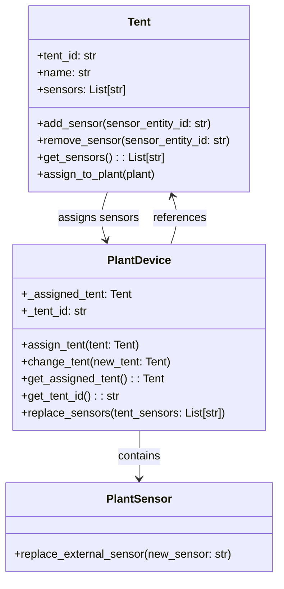
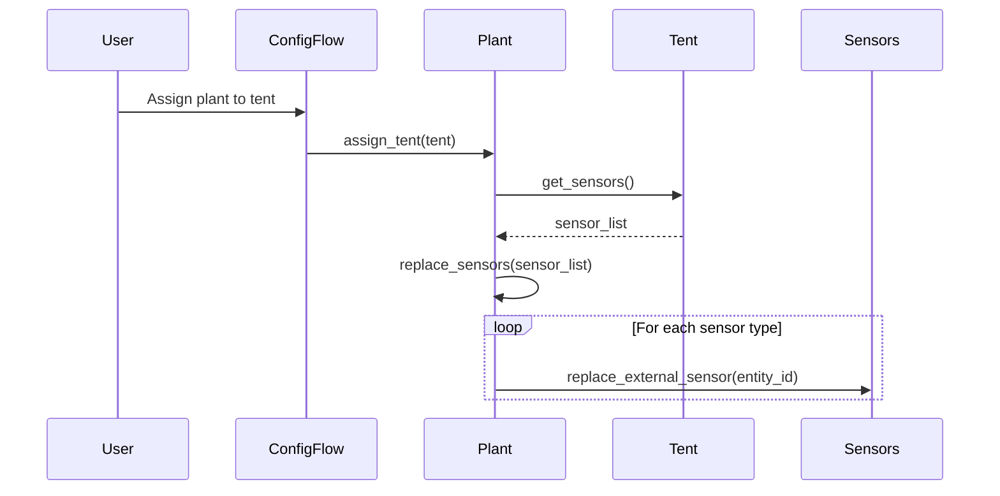

# Tent-Plant Sensor Configuration Feature

## Overview

This document describes the Tent-Plant sensor configuration feature in the Home Assistant Brokkoli integration. The feature allows Plants to be associated with Tents, enabling Plants to inherit sensor configurations from their assigned Tent. Plants can also be reassigned to different Tents to adopt their sensor configurations.

## Architecture

### Component Structure

The feature consists of two main components:

1. **Tent Class** - Manages a collection of sensors for environmental monitoring
2. **PlantDevice Class** - Represents a plant that can be associated with a Tent to inherit its sensor configuration

### Key Classes and Relationships

## Data Models

### Tent Entity

The Tent class manages a collection of sensors and can assign them to Plants:

| Property | Type | Description |
|----------|------|-------------|
| tent_id | string | Unique identifier for the tent |
| name | string | Human-readable name of the tent |
| sensors | List[string] | List of sensor entity IDs managed by this tent |
| journal | Journal | Documentation journal for the tent |
| maintenance_entries | List[MaintenanceEntry] | Maintenance records for the tent |

### PlantDevice Entity

The PlantDevice class can be associated with a Tent to inherit its sensor configuration:

| Property | Type | Description |
|----------|------|-------------|
| _assigned_tent | Tent | Reference to the currently assigned tent |
| _tent_id | string | ID of the assigned tent |
| sensor_temperature | PlantSensor | Temperature sensor for the plant |
| sensor_humidity | PlantSensor | Humidity sensor for the plant |
| sensor_illuminance | PlantSensor | Illuminance sensor for the plant |
| sensor_CO2 | PlantSensor | CO2 sensor for the plant |
| sensor_power_consumption | PlantSensor | Power consumption sensor for the plant |

## Business Logic

### Tent Sensor Management

1. **Sensor Assignment**: Tents maintain a list of sensor entity IDs for:
   - Temperature
   - CO2
   - Illuminance (Lux)
   - Humidity
   - Power consumption

2. **Sensor Operations**:
   - Adding sensors to a tent
   - Removing sensors from a tent
   - Retrieving the list of sensors from a tent

### Plant-Tent Association

1. **Initial Assignment**: When a Plant is created, it can be assigned to a Tent
2. **Sensor Inheritance**: The Plant inherits the Tent's sensor configuration
3. **Reassignment**: A Plant can be reassigned to a different Tent to adopt its sensor configuration

### Sensor Replacement Process

When a Plant is assigned to or changes Tents, the following process occurs:

## API Endpoints

### Configuration Flow

The feature integrates with the existing configuration flow:

1. **Tent Creation**:
   - Step ID: `tent`
   - Allows users to create a new tent with a name and select sensors

2. **Plant Creation with Tent Assignment**:
   - Step ID: `plant`
   - Includes an optional "assigned_tent" field in the form
   - Allows users to select an existing tent during plant creation

### Service Endpoints

The feature exposes the following methods:

| Method | Description |
|--------|-------------|
| `assign_tent(tent: Tent)` | Assigns a tent to a plant and replaces sensors |
| `change_tent(new_tent: Tent)` | Changes the assigned tent and updates sensors |
| `get_assigned_tent()` | Returns the currently assigned tent |
| `get_tent_id()` | Returns the ID of the assigned tent |

## Data Flow

### Tent Creation Process

1. User initiates tent creation through the configuration flow
2. System generates a unique tent ID
3. User provides tent name and selects sensors
4. System creates Tent entity with provided information
5. Tent is registered in Home Assistant device registry

### Plant Creation with Tent Assignment

1. User initiates plant creation through the configuration flow
2. User provides plant information and optionally selects a tent
3. If a tent is selected:
   - System retrieves the tent's sensor list
   - System assigns the tent to the plant
   - Plant replaces its sensors with the tent's sensors
4. System creates Plant entity with provided information
5. Plant is registered in Home Assistant device registry

### Plant-Tent Reassignment

1. User initiates plant update through the configuration flow
2. User selects a different tent (or none)
3. If a new tent is selected:
   - System retrieves the new tent's sensor list
   - System changes the plant's tent assignment
   - Plant replaces its sensors with the new tent's sensors
4. System updates Plant entity with new information

## Testing Strategy

### Unit Tests

1. **Tent Functionality**:
   - Test sensor addition and removal
   - Test sensor list retrieval
   - Test tent assignment to plants

2. **Plant-Tent Integration**:
   - Test initial tent assignment during plant creation
   - Test tent reassignment for existing plants
   - Test sensor replacement functionality

3. **Configuration Flow**:
   - Test tent creation flow
   - Test plant creation with tent assignment
   - Test plant update with tent reassignment

### Integration Tests

1. **End-to-End Flow**:
   - Create tent with sensors
   - Create plant assigned to tent
   - Verify sensor inheritance
   - Reassign plant to different tent
   - Verify sensor updates

2. **Error Handling**:
   - Test assignment to non-existent tent
   - Test sensor replacement with invalid sensors
   - Test concurrent tent modifications