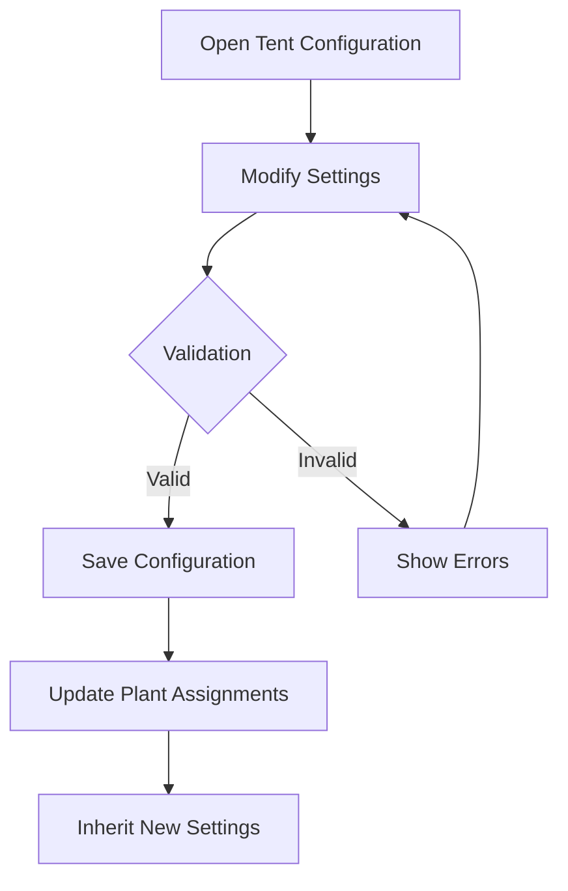

# Tent Reconfiguration and Camera Integration Guide

## Overview

This guide documents the enhanced Tent reconfiguration and Camera integration features for the Home Assistant Brokkoli Plant Manager. These improvements address critical usability issues and provide comprehensive camera functionality with inheritance from Tents to Plants.

## New Features

### 1. Tent Reconfiguration

Tents can now be fully reconfigured after initial setup, allowing users to:

- **Modify sensor assignments** for environmental monitoring
- **Assign or change camera entities** for visual monitoring  
- **Update tent names** for better organization
- **Change area assignments** for proper device organization
- **Validate entity availability** before applying changes

### 2. Enhanced Camera Integration

The camera system now supports:

- **External camera entity integration** instead of placeholder images
- **Automatic camera inheritance** from Tent to Plant
- **Real-time snapshot capture** from configured camera entities
- **Fallback mechanisms** when external cameras are unavailable
- **Improved image storage** with proper file management

## Configuration Guide

### Tent Reconfiguration

#### Accessing Tent Configuration

1. Navigate to **Configuration** → **Devices & Services**
2. Find your Plant integration
3. Select the Tent device you want to configure
4. Click **Configure**

#### Available Configuration Options

| Option | Description | Validation |
|--------|-------------|------------|
| **Name** | Change the tent display name | Must be unique |
| **Illuminance Sensor** | Assign light level monitoring | Must be available sensor entity |
| **Humidity Sensor** | Assign humidity monitoring | Must be available sensor entity |
| **CO2 Sensor** | Assign CO2 level monitoring | Must be available sensor entity |
| **Power Consumption Sensor** | Assign power monitoring | Must be available sensor entity |
| **pH Sensor** | Assign pH level monitoring | Must be available sensor entity |
| **Camera Entity** | Assign camera for snapshots | Must be available camera entity |
| **Area** | Assign tent to specific area | Must be valid area |

#### Example Configuration Flow



### Camera Integration

#### Camera Assignment Methods

##### Method 1: Direct Assignment to Plant
```yaml
# Via Plant Configuration
plant:
  camera_entity_id: camera.plant_camera_1
```

##### Method 2: Inheritance from Tent
```yaml
# Via Tent Configuration
tent:
  camera_entity_id: camera.tent_camera
  plants:
    - plant.tomato_1
    - plant.tomato_2  # Both inherit camera.tent_camera
```

#### Camera Entity Requirements

The camera entity must:
- Be a valid Home Assistant camera entity
- Have the domain `camera.*`
- Be in an available state (not `unavailable`)
- Support the `camera.snapshot` service

#### Supported Camera Types

| Camera Type | Compatibility | Notes |
|-------------|---------------|-------|
| **Generic Camera** | ✅ Full Support | Standard HA camera entities |
| **RTSP Cameras** | ✅ Full Support | Via camera integration |
| **USB Cameras** | ✅ Full Support | Via USB camera integration |
| **IP Cameras** | ✅ Full Support | Via manufacturer integrations |
| **Mobile App Cameras** | ✅ Full Support | Via HA Companion app |

## API Reference

### Configuration Flow Extensions

#### Tent Options Schema

```python
TENT_OPTIONS_SCHEMA = vol.Schema({
    vol.Optional(ATTR_NAME): cv.string,
    vol.Optional(FLOW_SENSOR_ILLUMINANCE): selector({
        ATTR_ENTITY: {
            ATTR_DEVICE_CLASS: SensorDeviceClass.ILLUMINANCE,
            ATTR_DOMAIN: DOMAIN_SENSOR,
        }
    }),
    vol.Optional(FLOW_SENSOR_HUMIDITY): selector({
        ATTR_ENTITY: {
            ATTR_DEVICE_CLASS: SensorDeviceClass.HUMIDITY,
            ATTR_DOMAIN: DOMAIN_SENSOR,
        }
    }),
    vol.Optional(FLOW_SENSOR_CO2): selector({
        ATTR_ENTITY: {
            ATTR_DEVICE_CLASS: SensorDeviceClass.CO2,
            ATTR_DOMAIN: DOMAIN_SENSOR,
        }
    }),
    vol.Optional(FLOW_SENSOR_POWER_CONSUMPTION): selector({
        ATTR_ENTITY: {
            ATTR_DEVICE_CLASS: SensorDeviceClass.POWER,
            ATTR_DOMAIN: DOMAIN_SENSOR,
        }
    }),
    vol.Optional(FLOW_SENSOR_PH): selector({
        ATTR_ENTITY: {
            ATTR_DEVICE_CLASS: SensorDeviceClass.PH,
            ATTR_DOMAIN: DOMAIN_SENSOR,
        }
    }),
    vol.Optional(\"camera_entity_id\"): selector({
        ATTR_ENTITY: {
            ATTR_DOMAIN: \"camera\",
        }
    }),
    vol.Optional(\"area_id\"): selector({
        \"area\": {}
    }),
})
```

### Plant Extensions

#### New Methods

```python
class PlantDevice:
    def assign_camera(self, camera_entity_id: str) -> None:
        \"\"\"Assign a camera to this plant.\"\"\"
        
    def inherit_tent_camera(self, tent) -> None:
        \"\"\"Inherit camera from assigned tent.\"\"\"
        
    def assign_tent(self, tent) -> None:
        \"\"\"Assign a tent and inherit its configuration.\"\"\"
        
    def change_tent(self, new_tent) -> None:
        \"\"\"Change assigned tent and update configuration.\"\"\"
        
    def get_assigned_tent(self):
        \"\"\"Get currently assigned tent.\"\"\"
        
    def get_tent_id(self) -> str:
        \"\"\"Get ID of assigned tent.\"\"\"
```

### Camera Extensions

#### Enhanced PlantCamera

```python
class PlantCamera(Camera):
    async def async_camera_image(self, width: int | None = None, height: int | None = None) -> bytes | None:
        \"\"\"Return image from external camera or fallback.\"\"\"
        
    async def async_take_snapshot(self) -> str | None:
        \"\"\"Take snapshot from external camera with fallback.\"\"\"
```

## Service Integration

### Enhanced Services

| Service | Description | New Parameters |
|---------|-------------|----------------|
| `plant.take_snapshot` | Take plant snapshot | Uses inherited or assigned camera |
| `plant.auto_snapshot` | Configure automatic snapshots | Supports camera inheritance |
| `plant.assign_tent` | Assign plant to tent | Inherits camera automatically |

### Service Examples

#### Taking a Snapshot

```yaml
# Service call
service: plant.take_snapshot
data:
  entity_id: plant.tomato_1
```

#### Configuring Automatic Snapshots

```yaml
# Service call  
service: plant.auto_snapshot
data:
  entity_id: plant.tomato_1
  interval_minutes: 120  # Every 2 hours
  enabled: true
```

## Validation and Error Handling

### Input Validation

The system validates all configuration changes:

#### Entity Validation
- **Existence Check**: Verifies entity exists in Home Assistant
- **Availability Check**: Ensures entity is not in `unavailable` state
- **Domain Check**: Validates entity has correct domain (e.g., `camera.*`)
- **Device Class Check**: Confirms sensors have appropriate device class

#### Area Validation
- **Area Existence**: Verifies area exists in area registry
- **Permission Check**: Ensures user can assign devices to area

### Error Messages

| Error Code | Message | Resolution |
|------------|---------|------------|
| `entity_not_found` | Entity nicht gefunden | Check entity ID spelling |
| `entity_unavailable` | Entity nicht verfügbar | Ensure entity is online |
| `invalid_domain` | Entity muss eine Kamera sein | Use camera.* entity |
| `area_not_found` | Bereich nicht gefunden | Select valid area |

### Graceful Degradation

When external cameras fail:
1. **Fallback to Placeholder**: System generates placeholder images
2. **Error Logging**: Detailed logs for troubleshooting  
3. **User Notification**: Clear feedback about camera status
4. **Service Continuity**: Other plant functions remain operational

## Migration Guide

### Existing Tent Configurations

Existing tents are fully compatible with the new system:

#### Automatic Migration
- No manual intervention required
- Existing sensor assignments preserved
- New options available immediately

#### Manual Updates Recommended
1. **Review sensor assignments** for accuracy
2. **Add camera entities** if available
3. **Assign areas** for better organization
4. **Update names** for clarity

### Existing Camera Setups

If you were using custom camera solutions:

#### Migration Steps
1. **Identify camera entities** in your system
2. **Assign cameras to tents** for sharing across plants
3. **Test snapshot functionality** with new integration
4. **Configure automatic snapshots** if desired

## Performance Considerations

### Camera Operations

#### Snapshot Performance
- **External Camera**: 2-5 seconds depending on camera
- **Fallback Mode**: <1 second for placeholder generation
- **Storage I/O**: Minimal impact with proper storage configuration

#### Memory Usage
- **Image Caching**: Last image cached in memory
- **File Storage**: Images stored to disk immediately
- **Cleanup**: Automatic cleanup of temporary files

### Configuration Updates

#### Validation Performance
- **Entity Checks**: <100ms per entity
- **Area Validation**: <50ms
- **Config Updates**: <200ms for complete tent update

## Troubleshooting

### Common Issues

#### Tent Configuration Not Saving
1. **Check entity validity**: Ensure all assigned entities exist
2. **Verify permissions**: Confirm user has configuration rights
3. **Review logs**: Check Home Assistant logs for errors

#### Camera Not Working
1. **Verify camera entity**: Test camera in Home Assistant directly
2. **Check camera service**: Ensure `camera.snapshot` works
3. **Review permissions**: Confirm camera access permissions
4. **Test fallback**: Verify placeholder images generate correctly

#### Plants Not Inheriting Camera
1. **Confirm tent assignment**: Verify plant is assigned to tent
2. **Check camera configuration**: Ensure tent has camera assigned
3. **Review inheritance logic**: Check plant-tent relationship

### Debug Information

#### Enabling Detailed Logging

```yaml
# configuration.yaml
logger:
  default: info
  logs:
    custom_components.plant: debug
    custom_components.plant.config_flow: debug
    custom_components.plant.camera: debug
```

#### Diagnostic Commands

```python
# Developer Tools > Services
service: plant.diagnostics
data:
  entity_id: plant.tomato_1
```

## Best Practices

### Tent Organization

1. **Logical Grouping**: Group plants by growing environment
2. **Sensor Sharing**: Use tent sensors for multiple plants when appropriate  
3. **Camera Placement**: Position cameras for optimal plant visibility
4. **Area Assignment**: Organize tents by physical location

### Camera Management

1. **Dedicated Cameras**: Use dedicated cameras per tent when possible
2. **Quality Settings**: Configure appropriate resolution for storage space
3. **Backup Strategy**: Consider camera redundancy for critical plants
4. **Maintenance Schedule**: Regular camera cleaning and positioning checks

### Performance Optimization

1. **Snapshot Frequency**: Balance monitoring needs with system load
2. **Storage Management**: Monitor disk space for image storage
3. **Network Bandwidth**: Consider impact of camera streams
4. **Error Monitoring**: Set up alerts for camera failures

## Conclusion

The enhanced Tent reconfiguration and Camera integration provide a robust foundation for professional plant monitoring. These features address the primary usability limitations while maintaining backward compatibility and system stability.

For additional support or feature requests, please refer to the project documentation or submit issues through the appropriate channels.